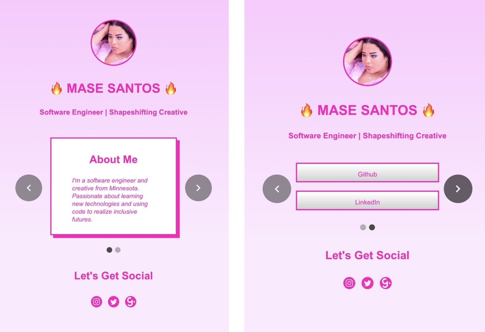

# Personal Social App

### Built By:
Mase Santos
>Duration: Day Project

## Application Overview

This application serves as a social media site for my social accounts, allowing users to be directed to my professional links on both mobile and desktop views. I decided to draw my original [Linktree](https://linktr.ee/) site as inspiration for the design, specifically tranferring over the background color, accent hot pink color, and button hierarchy. The most significant changes made were adding logo buttons for sites not included by Linktree (such as the [Girlboss](girlboss.com) website logo), making the site responsive to different window sizes (with mobile and desktop in mind), and creating a foundation to add customized links later should they be needed.

## Application Views

## Technologies Used

- JavaScript
- [React.js](https://reactjs.org/)
- [Material UI](https://material-ui.com/)
- [Adobe Illustrator](https://www.adobe.com/products/illustrator.html?sdid=KKQML&mv=search&ef_id=EAIaIQobChMIz9W0qumn6wIVRL7ACh3AeQzIEAAYASAAEgL69vD_BwE:G:s&s_kwcid=AL!3085!3!442365417815!e!!g!!adobe%20illustrator&gclid=EAIaIQobChMIz9W0qumn6wIVRL7ACh3AeQzIEAAYASAAEgL69vD_BwE)